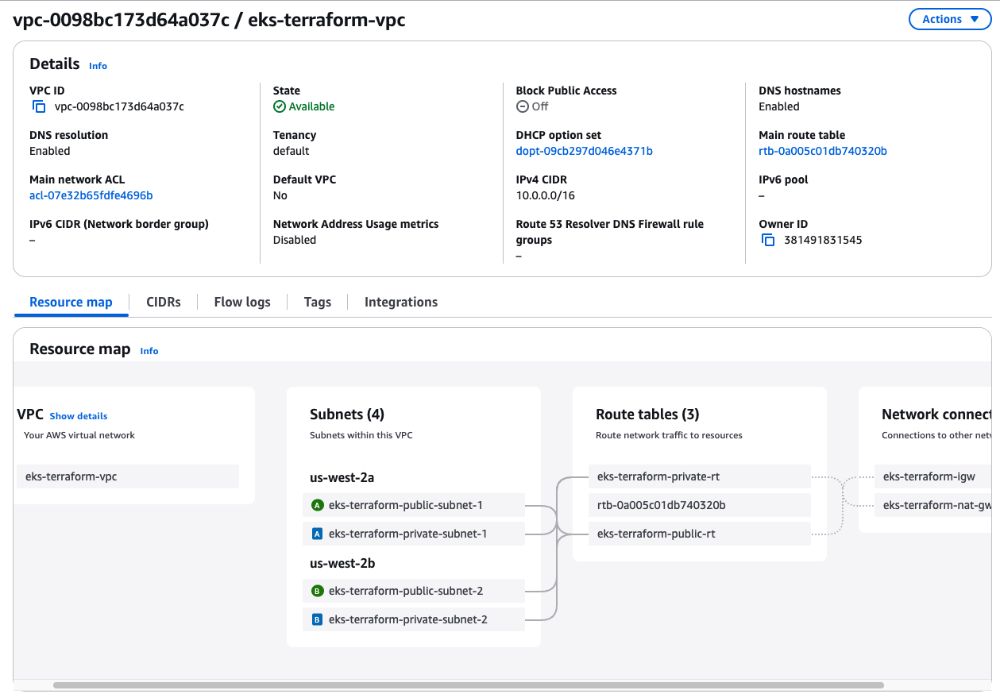
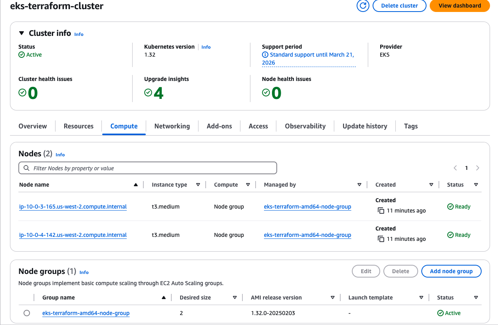
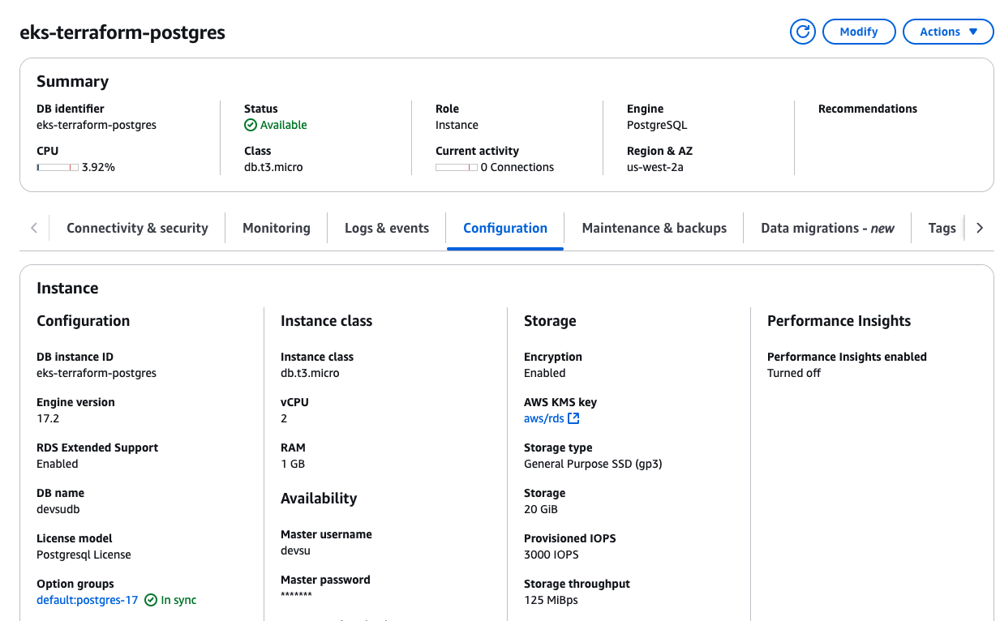
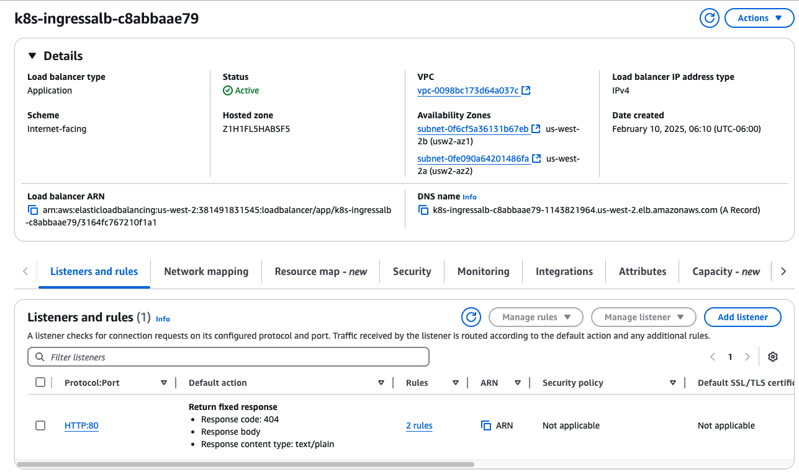
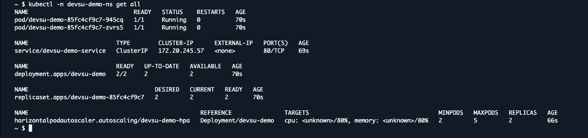
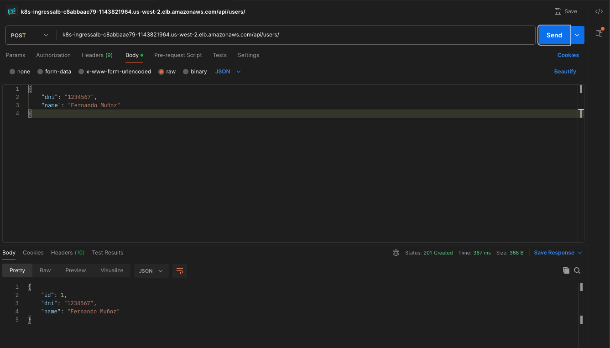
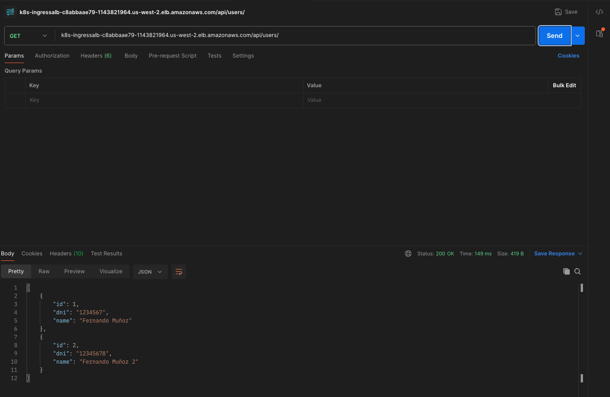
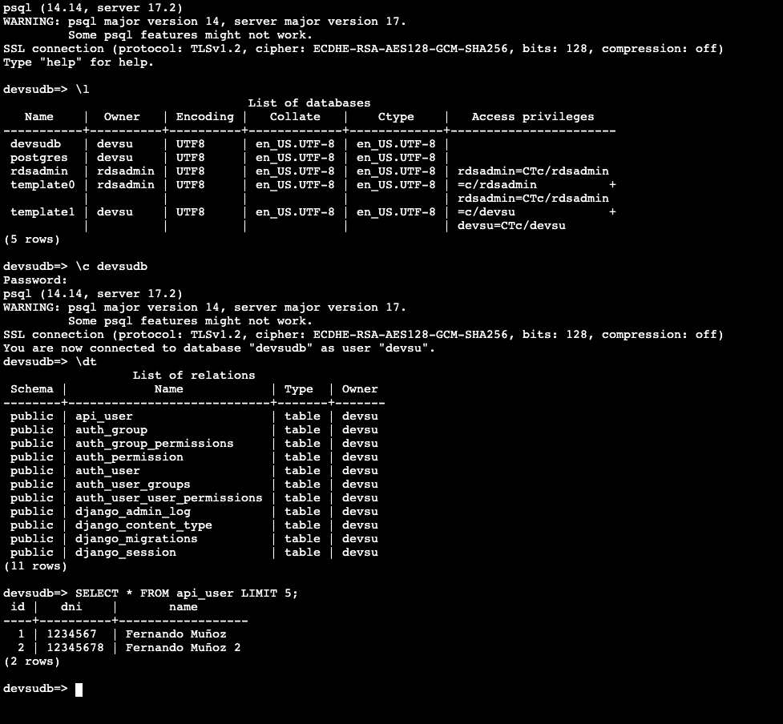

# devsu-devops-test

This repository contains the implementation of a technical test for a DevOps position.

| ⚠️ **Important note:** The following snapshots and pipelines were executed in an ephemeral AWS environment that only lasts 4 hours! |
|---|

## Repository Structure

### `/devsu-demo-devops-python`
A Django-based REST API application that serves as the main demo application:
- Simple user management API with CRUD operations.
- PostgreSQL database integration.
- Docker containerization support.
- Automated code formatting with Black and Isort.
- Comprehensive test suite.

Refer to the [devsu-demo-devops-python/README.md](devsu-demo-devops-python/README.md) for more details.

### `/eks-terraform`
Infrastructure as Code implementation using Terraform to create a EKS cluster:
- Complete VPC networking setup with public/private subnets.
- EKS cluster with managed node group.
- AWS Load Balancer Controller integration.
- Nginx Ingress Controller setup.
- PostgreSQL RDS instance.
- Security-focused configuration.
- Multi-tier ingress architecture.

Refer to the [eks-terraform/README.md](eks-terraform/README.md) for more details.

* Note: I already had this code in another repository of my authorship (https://github.com/Fernandrewm/eks-terraform), so I reused it and made the necessary adaptations.

### `/k8s`
Kubernetes manifests for deploying the Python application:
- Deployment configurations.
- Service definitions.
- Ingress resources.
- ConfigMaps and Secrets management.
- Horizon Pod Autoscaling.
- Health check configuration.
- Resource limits and requests.

### `/.github`
CI/CD workflows implemented in GitHub Actions:
- Automated testing pipeline.
- Docker image building and pushing.
- Infrastructure deployment.
- Application deployment to EKS.
- Security scanning.
- Code quality checks.

## Prerequisites
- AWS Account with appropriate permissions.
- Docker and Docker compose.
- Terraform.
- Python 3.11.3
- PostgreSQL 17.2

## Demostration

In this repository we have configured the following secrets:

- For AWS:
  - `AWS_ACCESS_KEY_ID`
  - `AWS_SECRET_ACCESS_KEY`
* Necessary for pipeline to create and interact with all resources in AWS.

- For PostgreSQL connection:
  - `DATABASE_HOST`
  - `DATABASE_NAME`
  - `DATABASE_PASSWORD`
  - `DATABASE_PORT`
  - `DATABASE_USER`
* Necessary for connect to the database.

- For Django Application:
  - `DJANGO_SECRET_KEY`
* Necessary for Django settings.

- For Docker:
  - `DOCKERHUB_TOKEN`
  - `DOCKERHUB_USERNAME`
* Necessary for build the Docker image and push it to the Docker Hub repository.  

- For EKS:
  - `KUBECONFIG`
* Necessary for interact with the EKS cluster.

### GitHub Actions Pipelines

- [Terraform Pipeline Executed](https://github.com/Fernandrewm/devsu-devops-test/actions/runs/13240250382)

- [CI/CD Application Pipeline Executed](https://github.com/Fernandrewm/devsu-devops-test/actions/runs/13240741720)

- Testing with Postman:
For this environment (remember that it's ephemeral), the AWS ALB is:
`k8s-ingressalb-c8abbaae79-1143821964.us-west-2.elb.amazonaws.com`

POST request:

GET request:

View data in the database:

### Future Improvements
- Migrate from GitHub Secrets to AWS Parameter Store / Secrets Manager for better secrets management and centralized control.
- Move Docker images from DockerHub to Amazon ECR for better security and integration with AWS services.
- Implement AWS WAF in front of the ALB to protect against common web exploits.
